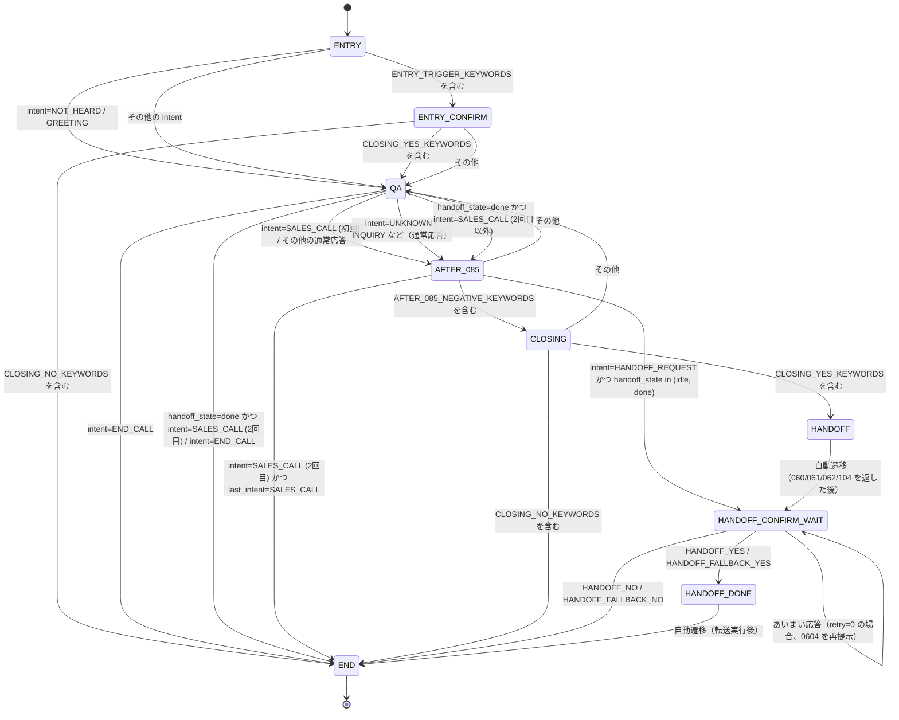
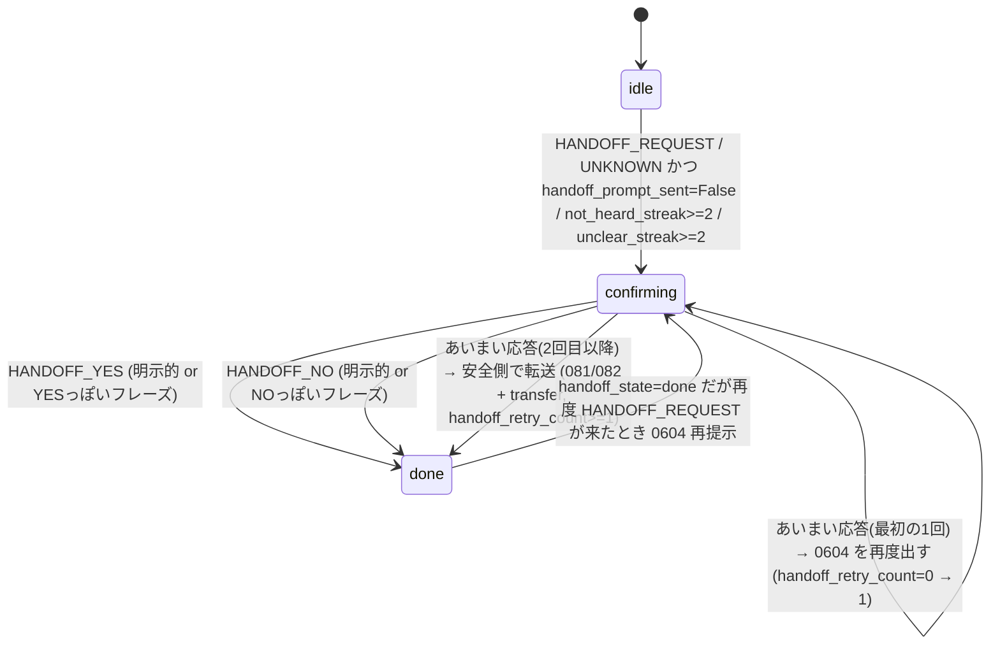

# AICore 状態管理・HANDOFF ロジック 現状仕様書

## 1. session_states[call_id] のキー一覧

| key | 型 / 値の例 | 初期値 | 説明（日本語・1〜2行） | 主に更新しているメソッド |
|-----|-------------|--------|------------------------|--------------------------|
| phase | str (`ENTRY` / `QA` / `AFTER_085` / `CLOSING` / `HANDOFF` / `HANDOFF_CONFIRM_WAIT` / `HANDOFF_DONE` / `END` / `ENTRY_CONFIRM`) | `"ENTRY"` | 会話全体のフェーズを表す。ENTRY から始まり、QA/AFTER_085/CLOSING/HANDOFF/HANDOFF_DONE/END などに遷移する。 | `_get_session_state`, `_handle_entry_phase`, `_handle_qa_phase`, `_handle_after_085_phase`, `_handle_closing_phase`, `_handle_handoff_phase`, `_handle_handoff_confirm`, `_run_conversation_flow`, `_generate_reply` |
| last_intent | str / None (`"SALES_CALL"` / `"END_CALL"` / `"HANDOFF_REQUEST"` / `"INQUIRY"` など) | `None` | 前回のユーザー発話の intent を保持。SALES_CALL が2回連続で来た場合の判定などに使用。 | `_handle_entry_phase`, `_handle_qa_phase`, `_handle_after_085_phase`, `_handle_entry_confirm_phase`, `_handle_closing_phase`, `_handle_handoff_phase` |
| handoff_state | str (`"idle"` / `"confirming"` / `"done"`) | `"idle"` | ハンドオフ（担当者への転送）の状態。idle=未開始、confirming=確認中、done=完了。 | `_handle_after_085_phase`, `_handle_handoff_confirm`, `_generate_reply`, `_on_asr_error` |
| handoff_retry_count | int (0, 1, 2...) | `0` | ハンドオフ確認（0604）を再提示した回数。0回目は再確認、1回以上は安全側で転送（081/082 + transfer）。 | `_handle_after_085_phase`, `_handle_handoff_confirm`, `_generate_reply` |
| transfer_requested | bool (`True` / `False`) | `False` | 転送リクエストが発行されたかどうか。True の場合、transfer_callback が呼ばれる。 | `_handle_after_085_phase`, `_handle_handoff_confirm`, `_generate_reply`, `_on_asr_error` |
| handoff_prompt_sent | bool (`True` / `False`) | `False` | ハンドオフ確認プロンプト（0604）を一度でも送信したかどうか。UNKNOWN 時の初回 0604 判定に使用。 | `_handle_after_085_phase`, `_generate_reply` |
| not_heard_streak | int (0, 1, 2...) | `0` | 「もう一度お願いします（110）」を連続で返した回数。2回以上で 0604 に切り替える。 | `_generate_reply` |
| unclear_streak | int (0, 1, 2...) | `0` | AI がよくわからない状態で返答した回数（110 が選ばれた回数）。2回以上で自動ハンドオフ発火。 | `_handle_handoff_confirm`, `_generate_reply` |
| handoff_completed | bool (`True` / `False`) | 未設定（動的追加） | ハンドオフ処理が完了したかどうか。HANDOFF_YES/NO が確定したときに True になる。 | `_handle_handoff_confirm`, `_handle_handoff_phase` |
| transfer_executed | bool (`True` / `False`) | 未設定（動的追加） | transfer_callback が実際に実行されたかどうか。二重実行を防ぐためのフラグ。 | `_handle_after_085_phase`, `_handle_handoff_confirm`, `_handle_handoff_phase`, `on_transcript`, `_on_asr_error` |
| last_ai_templates | List[str] (`["0604"]` / `["081", "082"]` など) | 未設定（動的追加） | 直前のAI応答で使用したテンプレートIDのリスト。HANDOFF判定用に保存。 | `_run_conversation_flow` |
| meta | Dict[str, Any] (`{"reason_for_handoff": "auto_unclear", "unclear_streak_at_trigger": 2}` など) | 未設定（動的追加） | ハンドオフ発火時のメタ情報。自動ハンドオフ（unclear_streak >= 2）の場合は reason_for_handoff が "auto_unclear" になる。 | `_generate_reply` |

---

## 2. phase の状態遷移図（全体フロー）

### 2.1 状態一覧

- **ENTRY**: 初期フェーズ。最初の発話を待つ。
- **ENTRY_CONFIRM**: ENTRY で ENTRY_TRIGGER_KEYWORDS（ホームページ、HP、LP、DM、メールなど）が検出された場合の確認フェーズ。
- **QA**: 通常の質問応答フェーズ。
- **AFTER_085**: SALES_CALL や通常の応答後に遷移するフェーズ。AFTER_085_NEGATIVE_KEYWORDS が検出されると CLOSING へ。
- **CLOSING**: クロージングフェーズ。YES 系応答で HANDOFF へ、NO 系応答で END へ。
- **HANDOFF**: ハンドオフ開始フェーズ（060/061/062/104 を返す）。
- **HANDOFF_CONFIRM_WAIT**: ハンドオフ確認待ちフェーズ（0604 を返した後、ユーザーの YES/NO を待つ）。
- **HANDOFF_DONE**: ハンドオフ完了フェーズ（081/082 を返した後、転送実行済み）。
- **END**: 会話終了フェーズ。自動切断タイマー（60秒）がセットされる。

### 2.2 状態遷移図（Mermaid）

### 2.3 状態遷移の詳細条件

#### ENTRY → QA
- `intent == "NOT_HEARD"`: 聞き取れない場合
- `intent == "GREETING"`: 挨拶の場合
- その他の intent（ENTRY_TRIGGER_KEYWORDS 以外）

#### ENTRY → ENTRY_CONFIRM
- `normalized_text` に `ENTRY_TRIGGER_KEYWORDS`（ホームページ、HP、LP、DM、メール、メッセージ、案内、連絡）が含まれる場合

#### ENTRY_CONFIRM → QA
- `normalized_text` に `CLOSING_YES_KEYWORDS` が含まれる場合

#### ENTRY_CONFIRM → END
- `normalized_text` に `CLOSING_NO_KEYWORDS` が含まれる場合

#### QA → AFTER_085
- `intent == "SALES_CALL"` かつ `last_intent != "SALES_CALL"`（初回）
- その他の通常応答（SALES_CALL / END_CALL 以外）

#### QA → END
- `intent == "END_CALL"`
- `intent == "SALES_CALL"` かつ `last_intent == "SALES_CALL"`（2回目）かつ `handoff_state == "done"`

#### AFTER_085 → CLOSING
- `normalized_text` に `AFTER_085_NEGATIVE_KEYWORDS`（もうだいじょうぶ、大丈夫です、ほかはない、以上です、けっこうです、たぶんいい、質問ない、他にない）が含まれる場合

#### AFTER_085 → QA
- その他の応答

#### AFTER_085 → HANDOFF_CONFIRM_WAIT
- `intent == "HANDOFF_REQUEST"` かつ `handoff_state in ("idle", "done")`

#### AFTER_085 → END
- `intent == "SALES_CALL"` かつ `last_intent == "SALES_CALL"`（2回目）

#### CLOSING → HANDOFF
- `normalized_text` に `CLOSING_YES_KEYWORDS`（はい、お願いします、頼む、教えて、知りたい、聞きたい、うん、いいよ、ぜひ、進めて、案内して）が含まれる場合

#### CLOSING → END
- `normalized_text` に `CLOSING_NO_KEYWORDS`（今日はいい、今日は聞くだけ、また考える、検討する、やめとく、不要、いりません、結構です、遠慮します、やめます、また連絡）が含まれる場合

#### HANDOFF → HANDOFF_CONFIRM_WAIT
- 自動遷移（060/061/062/104 を返した後、次の発話で `_handle_handoff_phase` が呼ばれる）

#### HANDOFF_CONFIRM_WAIT → HANDOFF_DONE
- `intent == "HANDOFF_YES"`（明示的または YES っぽいフレーズ）
- `intent == "HANDOFF_FALLBACK_YES"`（あいまい応答が2回目以降、安全側で転送）

#### HANDOFF_CONFIRM_WAIT → END
- `intent == "HANDOFF_NO"`（明示的または NO っぽいフレーズ）
- `intent == "HANDOFF_FALLBACK_NO"`

#### HANDOFF_CONFIRM_WAIT → HANDOFF_CONFIRM_WAIT
- あいまい応答（UNKNOWN など）かつ `handoff_retry_count == 0`（1回目の再確認）

#### HANDOFF_DONE → END
- 自動遷移（転送実行後）

---

## 3. HANDOFF 専用フロー図

### 3.1 handoff_state の状態遷移図（Mermaid）

### 3.2 intent × handoff_state の表

| handoff_state | user intent / 条件 | phase 例 | 出力テンプレ | handoff_state の変化 | transfer_requested | 備考 |
|---------------|-------------------|----------|-------------|---------------------|-------------------|------|
| idle | HANDOFF_REQUEST | AFTER_085 / QA など | 0604 | confirming | False | 既に done でも 0604 を再度出す仕様 |
| idle | UNKNOWN & handoff_prompt_sent=False | QA | 0604 | confirming | False | 「初回 UNKNOWN でいきなり 0604 出す」分岐 |
| idle | not_heard_streak>=2 | QA | 0604 | confirming | False | 「もう一度お願いします（110）」が2回連続 |
| idle | unclear_streak>=2 | QA | 0604 | confirming | False | 「よくわかりません（110）」が2回連続で自動ハンドオフ発火 |
| confirming | HANDOFF_YES or YESっぽい日本語 | HANDOFF / HANDOFF_CONFIRM_WAIT | 081 + 082 | done | True | transfer_callback 呼び出し / handoff_completed=True / transfer_executed=True |
| confirming | HANDOFF_NO or NOっぽい日本語 | HANDOFF / HANDOFF_CONFIRM_WAIT | 086 + 087 | done | False | END へ / 自動切断 60s 予約 / handoff_completed=True |
| confirming | UNKNOWN / その他, retry=0 | HANDOFF_CONFIRM_WAIT | 0604 | confirming (retry=1) | False | handoff_retry_count=0 → 1（もう一度だけ確認） |
| confirming | UNKNOWN / その他, retry>=1 | HANDOFF_CONFIRM_WAIT | 081 + 082 | confirming→done | True | 「安全側で転送」fall back / transfer_executed=True |
| done | HANDOFF_REQUEST | AFTER_085 / QA / ... | 0604 | confirming | False | 「2回目以降でも再度ハンドオフ確認」 |

### 3.3 handoff_retry_count と 0604 / 081 / 082 / 086 / 087 の関係

#### handoff_retry_count = 0（初回確認）
- **条件**: `handoff_state == "confirming"` かつ `handoff_retry_count == 0` で、あいまい応答（UNKNOWN など）が来た場合
- **動作**: 
  - `handoff_retry_count` を 1 にインクリメント
  - テンプレート **0604** を再提示
  - `handoff_state` は `"confirming"` のまま維持
  - `transfer_requested = False`

#### handoff_retry_count >= 1（2回目以降のあいまい応答）
- **条件**: `handoff_state == "confirming"` かつ `handoff_retry_count >= 1` で、あいまい応答が来た場合
- **動作**:
  - 安全側に倒して転送
  - テンプレート **081 + 082** を返す
  - `handoff_state` を `"done"` に変更
  - `handoff_retry_count` を 0 にリセット
  - `transfer_requested = True`
  - `transfer_executed = True`（transfer_callback 実行）

#### HANDOFF_YES（明示的または YES っぽいフレーズ）
- **条件**: `intent == "HANDOFF_YES"` または UNKNOWN/NOT_HEARD でも YES 系フレーズ（はい、お願いします、ええ、うん など）が含まれる
- **動作**:
  - テンプレート **081 + 082** を返す
  - `handoff_state` を `"done"` に変更
  - `handoff_retry_count` を 0 にリセット
  - `transfer_requested = True`
  - `handoff_completed = True`
  - `transfer_executed = True`（transfer_callback 実行）
  - `phase` を `"HANDOFF_DONE"` に変更

#### HANDOFF_NO（明示的または NO っぽいフレーズ）
- **条件**: `intent == "HANDOFF_NO"` または UNKNOWN/END_CALL/NOT_HEARD でも NO 系フレーズ（CLOSING_NO_KEYWORDS または「いらない」）が含まれる
- **動作**:
  - テンプレート **086 + 087** を返す
  - `handoff_state` を `"done"` に変更
  - `handoff_retry_count` を 0 にリセット
  - `transfer_requested = False`
  - `handoff_completed = True`
  - `phase` を `"END"` に変更
  - 自動切断タイマー（60秒）をセット

### 3.4 特殊な HANDOFF 発火条件

#### 1. not_heard_streak >= 2（「もう一度お願いします」が2回連続）
- **条件**: `template_ids == ["110"]` が2回連続で選ばれた場合
- **動作**:
  - `not_heard_streak` を 0 にリセット
  - `handoff_state` を `"confirming"` に変更
  - `handoff_prompt_sent = True`
  - `transfer_requested = False`
  - テンプレート **0604** を返す

#### 2. unclear_streak >= 2（「よくわかりません」が2回連続）
- **条件**: `template_ids == ["110"]` が2回連続で選ばれ、`unclear_streak >= 2` かつ `handoff_state in ("idle", "done")` かつ `intent not in ("HANDOFF_REQUEST", "HANDOFF_YES", "HANDOFF_NO")`
- **動作**:
  - `meta` に `{"reason_for_handoff": "auto_unclear", "unclear_streak_at_trigger": unclear_streak}` を設定
  - `intent` を強制的に `"HANDOFF_REQUEST"` に変更
  - テンプレート **0604** を返す
  - `handoff_state` を `"confirming"` に変更

#### 3. UNKNOWN 初回（handoff_prompt_sent=False）
- **条件**: `intent == "UNKNOWN"` かつ `handoff_state == "idle"` かつ `handoff_prompt_sent == False`
- **動作**:
  - `handoff_state` を `"confirming"` に変更
  - `handoff_retry_count = 0`
  - `handoff_prompt_sent = True`
  - `transfer_requested = False`
  - テンプレート **0604** を返す

#### 4. handoff_state=done でも HANDOFF_REQUEST が来た場合
- **条件**: `intent == "HANDOFF_REQUEST"` かつ `handoff_state == "done"`
- **動作**:
  - `handoff_state` を `"confirming"` に変更（再確認）
  - `handoff_retry_count = 0`
  - `handoff_prompt_sent = True`
  - `transfer_requested = False`
  - `transfer_executed = False`（転送フラグもリセット）
  - テンプレート **0604** を返す

---

## 4. 補足情報

### 4.1 テンプレートID の意味

- **0604**: 「恐れ入りますが、担当者におつなぎいたしますか？」
- **081**: 「それでは、担当者におつなぎいたします。」
- **082**: 「少々お待ちください。」
- **086**: 「承知いたしました。」
- **087**: 「失礼いたします。」
- **110**: 「もう一度お願いします。」

### 4.2 自動切断タイマー

- **条件**: `phase == "END"` に遷移したとき、または **086 + 087** が選ばれたとき
- **動作**: `hangup_callback` が設定されている場合、60秒後に自動切断タイマーをセット
- **例外**: `transfer_requested == True` の場合は自動切断をセットしない

### 4.3 transfer_callback の実行タイミング

- `transfer_requested == True` かつ `transfer_executed == False` のとき、一度だけ実行される
- 実行後、`transfer_executed = True` に設定され、二重実行を防ぐ

### 4.4 unclear_streak のリセット条件

- 通常の回答テンプレート（006, 006_SYS, 010, 004, 005, 020, 021, 022, 023, 040, 041, 042, 060, 061, 070, 071, 072, 080, 081, 082, 084, 085, 086, 087, 088, 089, 090, 091, 092, 099, 100, 101, 102, 103, 104, 0600, 0601, 0602, 0603, 0604）が選ばれたとき
- `handoff_state` が `"done"` に遷移したとき

---

**注意**: このドキュメントは現状仕様を記述したものです。実装の変更や改善案は含まれていません。

